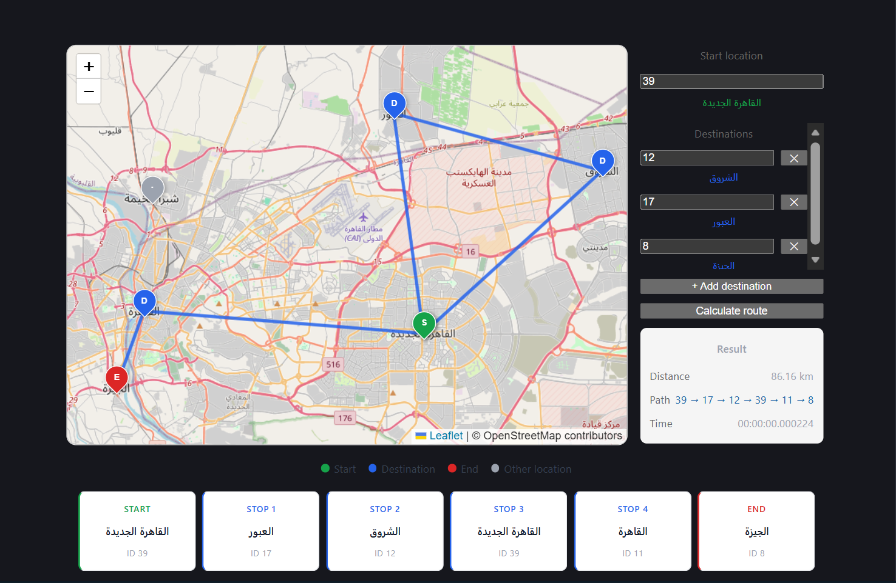

# 🚀 Smart Route Optimization System

An interactive web application that computes the optimal route between multiple locations using graph search algorithms.

## 📌 Overview

This project allows users to:

* Select a start location and multiple destinations
* Visualize routes on an interactive map
* Compute optimized paths using backend algorithms
* View total distance and execution time

## 🧠 Key Features

* 🗺️ Interactive map using Leaflet
* 📍 Click-based location selection
* 🔄 Dynamic route visualization with animated polylines
* ⚡ Optimized routing using A* / search algorithms
* 📊 Distance & performance metrics

## 🏗️ Tech Stack

### Frontend

* React.js
* Leaflet (react-leaflet)

### Backend

* Django / Django REST Framework

### Algorithms

* A* Search
* Graph-based pathfinding

## 📸 Demo



## ⚙️ Installation

### Backend

```bash
cd backend
pip install -r requirements.txt
python manage.py runserver
```

### Frontend

```bash
cd frontend
npm install
npm run dev
```

## 📡 API Example

```json
POST /routes/optimize-route/
{
  "start_location": { "lat": 30.0444, "lon": 31.2357 },
  "destinations": [
    { "lat": 30.05, "lon": 31.24 }
  ]
}
```

## 💡 Future Improvements

* Add real road routing (Google Maps API / OSRM)
* Add authentication & user history
* Improve UI/UX with better controls
* Mobile responsiveness

## 👨‍💻 Author

Your Name
